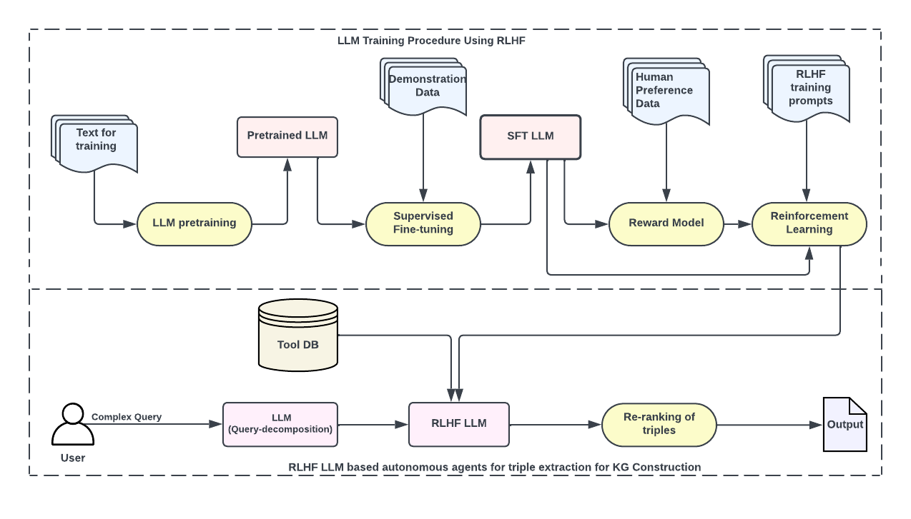

# Text2kg_LLM_KGAgent

This repository contains the code and resources for the research project "Towards Harnessing Large Language Models as Autonomous Agents for Semantic Triple Extraction from Unstructured Text". The project aims to develop a framework that integrates Large Language Models (LLMs) with existing tools like REBEL and KnowGL for the task of triple extraction from unstructured text to construct knowledge graphs.

## Overview
The Figure below  outlines a framework for training a Large Language Model (LLM) using a method referred to as RLHF, which stands for Reinforcement Learning from Human Feedback. The flowchart is divided into two main sections: 
- The LLM training procedure using RLHF 
- RLHF LLM Based Autonomous Agents for Triple Extraction for KG Construction



The proposed framework leverages the strengths of LLMs in understanding complex linguistic structures, handling modalities and negations, and mitigating biases inherent in training data. The experiments were carried on the CONLL04 dataset.

## Repository Structure

The `TEXT2TRIPLE-LLM-AGENT` repository is organized into several directories and files that facilitate the process of data pre-processing, prediction generation, processing, and evaluation. Below is the structure of the repository:
```
Text2Triple
│
├── CONLL04_preprocessing/
│   ├── conll04_formatting.py  # Script for formatting the CONLL04 dataset.
│   └── evalFileGeneration.py  # Script for generating evaluation files.
│
├── data/
│   ├── conll04/
│   │   ├── conll04_prediction_example.json  # Example prediction file for CONLL04.
│   │   ├── conll04_train_dev.json  # Training and development dataset for CONLL04.
│   │   └── conll04_types.json  # File containing types for the CONLL04 dataset.
│   ├── dev.json  # Development dataset.
│   ├── test.json  # Test dataset.
│   └── train.json  # Training dataset.
│
├── datasets/
│   └── conll04/
│       └── conll04_eval.json  # Evaluation file for the CONLL04 dataset.
│
├── GeneratedData/
│   ├── Prediction/  # Contains generated JSON predictions.
│   ├── Processingforeval/  # Contains JSON files processed for evaluation.
│   └── Score/  # Contains txt scoring files.
│
├── src/
│   ├── Evaluation/
│   │   └── evalRE.py  # Script for evaluating relation extraction.
│   ├── Prediction/
│   │   ├── generatePredictionLLLMNER.py  # Script for generating predictions with LLM NER.
│   │   ├── generatePredictionOnlyFramework.py  # Script for generating predictions using only the framework using tools REBEL and KnowGL.
│   │   └── generatePredictionsLLLMsingleTool.py  # Script for generating predictions with a single tool LLM. (REBEL only)
|   |   └── generatePredictionsLLLMMultiTool.py  # Script for generating predictions with a Multi tool LLM. (REBEL + KnowGL)
│   ├── Processing/
│   │   └── Processingforeval.py  # Script for processing for evaluation.
│   ├── SystemLLM/
│   │   ├── LLMmultiTool.py  # Script for LLM with multi-tool support.
│   │   └── LLMsingleTool.py  # Script for LLM with single-tool support. (REBEL only)
│   └── Tools/
│       ├── FlairNER.py  # Script for Flair NER tool.
│       ├── KnowGL.py  # Script for KnowGL tool.
│       ├── multiToolRE.py  # Script for multi-tool relation extraction.
│       └── REBEL.py  # Script for REBEL tool.
│
├── requirements.txt  # Text file listing the dependencies required for the repository.
├── run_multi_tool.bash  # Bash script to automate the process using multiple tools.
├── run_single_tool_noLLM.bash  # Bash script to run the process with a single tool without LLM.
├── run_single_tool.bash  # Bash script to run the process with a single tool.
└── ipynbFiles  # Contains ipynb files for EDA and calculating scores. However, running the pipeline will also generates these scores.
```


## Getting Started


### Generating the Evaluation and Ground Truth File in desired JSON Format

1. Install the required dependencies:

```
pip install -r requirements.txt
```
- Please note the folllowing code requires version of `python > 3.3`
- Please set-up a virtual environment`
- The dependencies are compatible for Mac M1, other OS might need to change the requirements accordingly

2. Download the CONLL04 dataset and place it in the [data/conll04](data/conll04) directory. I have already placed the dataset there.

3. Run the pre-processing script to format the dataset:

```
python CONLL04preprocessing/conll04_formatting.py
```
- The first command will format the CONLLO4 test dataset in the desired JSON format and generate it and this generated will stored at the location [data/datasets/conll04/test_triples.json](data/datasets/conll04/test_triples.json). In case you directly want access to the file you can directly find the file in [ipynb files/dataFiles/golden_truth.json](https://github.com/Ananyaiitbhilai/Text2Triple-LLM-Agent/blob/main/ipynb%20files/dataFiles/golden_truth.json)
```
python CONLL04preprocessing/evalFileGeneration.py
```
- The second command will generate a evaluation file on which predictions will be made by our pipeline. If you want direct acess to the file, it is already at the location [data/datasets/conll04/conll04_eval.json](data/datasets/conll04/conll04_eval.json)
- These above two files' path are also set in all the three Bash files


### Carrying out Evaluation and getting Final Scores 
1. In the [.env](.env) file, give your LLM's path (It should be with GGUF extension). We used `TheBloke/Mistral-7B-Instruct-v0.2-GGUF/mistral-7b-instruct-v0.2.Q4_K_S.gguf` and `lmstudio-ai/gemma-2b-it-GGUF/gemma-2b-it-q8_0.gguf`

2. There are 3 bash files for multi-tool, single-tool, and single-tool no LLM usage:
- [run_multi_tool.bash](run_multi_tool.bash): Bash script to run the pipeline using multiple tools.
- [run_single_tool_noLLM.bash](run_single_tool_noLLM.bash): Bash script to run the pipeline with a single tool without LLM.
- [run_single_tool.bash](run_single_tool.bash): Bash script to run the pipeline with a single tool.


3. Run the evaluation script for multi-tool or single-tool usage:

```
chmod +x <bash file you want to run>
```
```
./<bash file you want to run>  
```

4. You will see all the generate files in the [GeneratedData Folder](GeneratedData) and the scores will be stored in text files in [GeneratedData/Score](GeneratedData/Score)


## Table 1: Model Performance Metrics

| Model                          | Micro       |            |            | Macro       |            |            | Extras |
|--------------------------------|-------------|------------|------------|-------------|------------|------------|--------|
|                                | P           | R          | F1         | P           | R          | F1         |        |
| REBEL                          | 0.16        | 0.16       | 0.16       | 0.18        | 0.18       | 0.18       | 356    |
| REBEL (subset Mistral)         | 0.15        | 0.15       | 0.15       | 0.17        | 0.17       | 0.17       | 330    |
| REBEL (subset Gemma)           | 0.18        | 0.19       | 0.18       | 0.21        | 0.21       | 0.21       | 235    |
| MISTRAL (single-tool REBEL)    | 0.15        | 0.15       | 0.15       | 0.17        | 0.17       | 0.17       | 323    |
| GEMMA (single-tool REBEL)      | 0.15        | 0.16       | 0.16       | 0.18        | 0.18       | 0.18       | 241    |
| KNOWGL                         | 0.05        | 0.05       | 0.05       | 0.07        | 0.06       | 0.07       | 372    |
| Mistral (KNOWGL + REBEL multi-tool) | 0.05   | 0.07       | 0.06       | 0.08        | 0.09       | 0.08       | 533    |

## Table 2: Total Responses and Number of Hallucinations

| Model                | Total Responses | Number of Hallucinations |
|----------------------|-----------------|--------------------------|
| Gemma                | 288             | 99                       |
| Mistral (single-tool)| 288             | 26                       |
| Mistral (multi-tool) | 288             | 42                       |


## Contributing

Contributions to this project are welcome. If you encounter any issues or have suggestions for improvements, please open an issue or submit a pull request.
